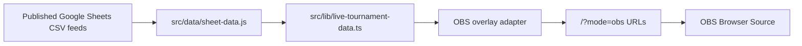

# OBS Browser Source Overlays

Legion Wars supports stream-safe browser overlays from the same Firebase-hosted app and the same public Google Sheets data path as the public bracket viewer.

## Recommendation

Use OBS Browser Source URLs with `mode=obs`.

This is the best fit because OBS Browser Source loads a normal URL with a fixed viewport, custom CSS support, refresh controls, and transparent-background support. The overlay stays static-hosted on Firebase, uses the existing React app, and keeps the stream surface separate from the public viewer UI.

Do not create a separate Discord bot, staff control panel, or second parser for this. Those would add operational risk without improving the first broadcast use case.

## Data Flow



The overlay consumes only the public-safe feeds already used by the website:

- Group Titan
- Group Nexus
- Group Dominion
- Wildcard
- National Finals

It does not consume Master Sheet, Player Details, private registration data, Discord operations, staff notes, or broadcast planning data.

## URL Format

Base:

```text
https://cci-legion-wars.web.app/?mode=obs&view=titan&source=bracket
```

Supported `view` values:

```text
titan
nexus
dominion
wildcard
finals
```

Group overlays support `source`:

```text
source=bracket
source=route
source=round
```

Group round callouts additionally support:

```text
round=1
round=2
round=3
round=4
lobby=TITAN_R4_L1
```

Finals overlays support:

```text
round=1
round=2
round=3
round=4
```

Transparent background:

```text
transparent=1
```

## OBS Scene URLs

### Group Bracket Sources

Group Titan overall bracket:

```text
https://cci-legion-wars.web.app/?mode=obs&view=titan&source=bracket
```

Group Nexus overall bracket:

```text
https://cci-legion-wars.web.app/?mode=obs&view=nexus&source=bracket
```

Group Dominion overall bracket:

```text
https://cci-legion-wars.web.app/?mode=obs&view=dominion&source=bracket
```

Each overall group bracket source shows Round 1 through Round 4 as columns, with all lobbies and the qualifying route out of each lobby.

### Group Route Sources

Group Titan National Finals / Wildcard route:

```text
https://cci-legion-wars.web.app/?mode=obs&view=titan&source=route
```

Group Nexus National Finals / Wildcard route:

```text
https://cci-legion-wars.web.app/?mode=obs&view=nexus&source=route
```

Group Dominion National Finals / Wildcard route:

```text
https://cci-legion-wars.web.app/?mode=obs&view=dominion&source=route
```

Each route source focuses on Round 4 and splits the group into direct National Finals qualifiers and Wildcard pool players.

### Focused Group Round Sources

Group Titan Round 4:

```text
https://cci-legion-wars.web.app/?mode=obs&view=titan&source=round&round=4
```

Group Titan specific lobby:

```text
https://cci-legion-wars.web.app/?mode=obs&view=titan&source=round&round=4&lobby=TITAN_R4_L1
```

Use focused group round sources for callouts during live matches.

### Wildcard Source

Wildcard:

```text
https://cci-legion-wars.web.app/?mode=obs&view=wildcard
```

### National Finals Sources

Round of 16:

```text
https://cci-legion-wars.web.app/?mode=obs&view=finals&round=1
```

Quarterfinals:

```text
https://cci-legion-wars.web.app/?mode=obs&view=finals&round=2
```

Semifinals:

```text
https://cci-legion-wars.web.app/?mode=obs&view=finals&round=3
```

Grand Final:

```text
https://cci-legion-wars.web.app/?mode=obs&view=finals&round=4
```

Transparent Group Titan route:

```text
https://cci-legion-wars.web.app/?mode=obs&view=titan&source=route&transparent=1
```

## OBS Setup

Recommended Browser Source settings:

- Width: `1920`
- Height: `1080`
- FPS: `30`
- URL: one of the overlay URLs above
- Refresh browser source when scene becomes active: on for tournament scene changes
- Shutdown source when not visible: optional; leave off if instant scene switching matters
- Custom CSS: keep OBS default transparent CSS, or leave empty for the app background

For transparent overlays, use `transparent=1` in the URL and keep OBS's transparent browser CSS behavior.

## Operating Model

Create one OBS scene or source per common tournament state:

- `LW - Titan Overall Bracket`
- `LW - Titan Finals Wildcard Route`
- `LW - Nexus Overall Bracket`
- `LW - Nexus Finals Wildcard Route`
- `LW - Dominion Overall Bracket`
- `LW - Dominion Finals Wildcard Route`
- `LW - Wildcard`
- `LW - Finals Round of 16`
- `LW - Finals Quarterfinals`
- `LW - Finals Semifinals`
- `LW - Finals Grand Final`

For a stream focused on one group, use that group's overall bracket source as the main bracket board. Switch to that group's route source after Round 4 to show who reached National Finals and who entered Wildcard. Use focused round or lobby URLs only for live callouts.

## Architecture Notes

- The public website remains the default route.
- `mode=obs` switches the same route into a broadcast overlay surface.
- Query parameters drive the source, so OBS does not need a control API.
- Firebase Hosting still serves the SPA from `dist`.
- The existing `firebase.json` rewrite continues to work because the overlay is query-driven on `/`.
- The overlay uses the existing `useLiveTournamentData` hook, parser/cache/fallback behavior, and public safety rules.
- No mock data is used as production truth.

## Current Limitations

- The first implementation is display-only. It does not provide a remote operator control panel.
- OBS scene switching should be handled by saved Browser Source URLs.
- Group overall bracket sources are dense by design because they show every lobby in the group route. Use a focused `source=round` or `lobby` URL for single-lobby broadcast moments.
- If a sheet has pending or placeholder players, the overlay will show pending state rather than invent data.

## Future Expansion

Useful later, not needed for the first broadcast-ready version:

- `/overlay` path alias for prettier URLs.
- OBS WebSocket scene/source switching helper.
- Preset generator page for copying scene URLs.
- Lower-third player spotlight overlay.
- Automatic "current live lobby" selection when the sheet marks lobbies live.
- QR-free operator handoff sheet with approved overlay URLs.

## Research Sources

- OBS Browser Source knowledge base: `https://obsproject.com/kb/browser-source`
- Firebase Hosting configuration docs: `https://firebase.google.com/docs/hosting/full-config`
