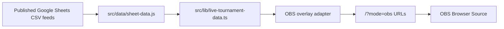

# OBS Browser Source Overlays

Legion Wars supports stream-safe browser overlays from the same Firebase-hosted app and the same public Google Sheets data path as the public bracket viewer.

## Recommendation

Use OBS Browser Source URLs with `mode=obs`.

This is the best fit because OBS Browser Source loads a normal URL with a fixed viewport, custom CSS support, refresh controls, and transparent-background support. The overlay stays static-hosted on Firebase, uses the existing React app, and keeps the stream surface separate from the public viewer UI.

Do not create a separate Discord bot, staff control panel, or second parser for this. Those would add operational risk without improving the first broadcast use case.

## Data Flow



The overlay consumes only the public-safe feeds already used by the website:

- Group Titan / Group A
- Group Nexus / Group B
- Group Dominion / Group C
- Wildcard
- National Finals

It does not consume Master Sheet, Player Details, private registration data, Discord operations, staff notes, or broadcast planning data.

## URL Format

Base:

```text
https://cci-legion-wars.web.app/?mode=obs&view=overview
```

Supported `view` values:

```text
overview
titan
nexus
dominion
wildcard
finals
```

Group overlays support:

```text
round=1
round=2
round=3
round=4
lobby=TITAN_R4_L1
```

Finals overlays support:

```text
round=1
round=2
round=3
round=4
```

Transparent background:

```text
transparent=1
```

## OBS Scene URLs

Overview:

```text
https://cci-legion-wars.web.app/?mode=obs&view=overview
```

Group A current/default round:

```text
https://cci-legion-wars.web.app/?mode=obs&view=titan
```

Group A Round 4:

```text
https://cci-legion-wars.web.app/?mode=obs&view=titan&round=4
```

Group A specific lobby:

```text
https://cci-legion-wars.web.app/?mode=obs&view=titan&round=4&lobby=TITAN_R4_L1
```

Group B Round 4:

```text
https://cci-legion-wars.web.app/?mode=obs&view=nexus&round=4
```

Group C Round 4:

```text
https://cci-legion-wars.web.app/?mode=obs&view=dominion&round=4
```

Wildcard:

```text
https://cci-legion-wars.web.app/?mode=obs&view=wildcard
```

Finals full bracket:

```text
https://cci-legion-wars.web.app/?mode=obs&view=finals
```

Finals focused round:

```text
https://cci-legion-wars.web.app/?mode=obs&view=finals&round=1
```

Transparent Group A Round 4:

```text
https://cci-legion-wars.web.app/?mode=obs&view=titan&round=4&transparent=1
```

## OBS Setup

Recommended Browser Source settings:

- Width: `1920`
- Height: `1080`
- FPS: `30`
- URL: one of the overlay URLs above
- Refresh browser source when scene becomes active: on for tournament scene changes
- Shutdown source when not visible: optional; leave off if instant scene switching matters
- Custom CSS: keep OBS default transparent CSS, or leave empty for the app background

For transparent overlays, use `transparent=1` in the URL and keep OBS's transparent browser CSS behavior.

## Operating Model

Create one OBS scene or source per common tournament state:

- `LW - Overview`
- `LW - Group A Current`
- `LW - Group A R4`
- `LW - Group B R4`
- `LW - Group C R4`
- `LW - Wildcard`
- `LW - Finals`
- `LW - Finals Round Focus`

For a stream focused on one group, use the group URL as the main overlay. For previous group results, switch to that group's saved scene/source URL. For a single lobby callout, use the `lobby` query parameter.

## Architecture Notes

- The public website remains the default route.
- `mode=obs` switches the same route into a broadcast overlay surface.
- Query parameters drive the view, so OBS does not need a control API.
- Firebase Hosting still serves the SPA from `dist`.
- The existing `firebase.json` rewrite continues to work because the overlay is query-driven on `/`.
- The overlay uses the existing `useLiveTournamentData` hook, parser/cache/fallback behavior, and public safety rules.
- No mock data is used as production truth.

## Current Limitations

- The first implementation is display-only. It does not provide a remote operator control panel.
- OBS scene switching should be handled by saved Browser Source URLs.
- Round 1 group views can be dense because they may show 16 lobbies. Use a focused `lobby` URL for single-lobby broadcast moments.
- If a sheet has pending or placeholder players, the overlay will show pending state rather than invent data.

## Future Expansion

Useful later, not needed for the first broadcast-ready version:

- `/overlay` path alias for prettier URLs.
- OBS WebSocket scene/source switching helper.
- Preset generator page for copying scene URLs.
- Lower-third player spotlight overlay.
- Automatic "current live lobby" selection when the sheet marks lobbies live.
- QR-free operator handoff sheet with approved overlay URLs.

## Research Sources

- OBS Browser Source knowledge base: `https://obsproject.com/kb/browser-source`
- Firebase Hosting configuration docs: `https://firebase.google.com/docs/hosting/full-config`
