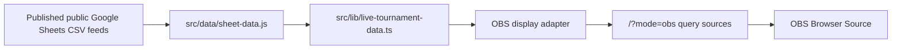

# OBS Broadcast Sources

Legion Wars OBS screens are browser-source views served by the same Firebase app as the public bracket viewer. They use the same public Google Sheets feeds, parser/cache/fallback behavior, and public-data safety rules.

The OBS package is built as an original premium esports broadcast board. It uses code-native layered plates, crest-backed logo placement, medallions, bracket lanes, route split symbols, and champion-slot frames. It does not use third-party game logos, copied broadcast screenshots, or mock data as production truth.

- persistent medallion phase rail: Groups -> Wildcard -> Nationals -> Champion
- stage-board sources for each named group
- route sources that show Round 4 qualifiers splitting into National Finals and Wildcard
- Wildcard board showing Titan, Nexus, and Dominion feeds into National Finals slots
- Finals round boards with bracket lanes, advancement state, and champion slot

No OBS screen consumes Master Sheet, Player Details, registration data, private contact data, staff notes, Discord operations, or mock data as production truth.

Rendered reference thumbnails are stored in:

```text
OBS Screen Thumbnails/
```

## Data Flow



## Browser Source Settings

Use these settings for every full-screen source:

- Width: `1920`
- Height: `1080`
- FPS: `30`
- Refresh browser source when scene becomes active: on
- Shutdown source when not visible: optional
- Custom CSS: leave empty unless the production operator needs transparent composition

Transparent mode is supported by appending:

```text
&transparent=1
```

## Source Map

Primary copy/paste OBS calls:

| OBS source name                     | Browser source URL                                                       |
| ----------------------------------- | ------------------------------------------------------------------------ |
| `LW - Titan Stage Board`            | `https://cci-legion-wars.web.app/?mode=obs&view=titan&source=bracket`    |
| `LW - Titan Qualification Route`    | `https://cci-legion-wars.web.app/?mode=obs&view=titan&source=route`      |
| `LW - Nexus Stage Board`            | `https://cci-legion-wars.web.app/?mode=obs&view=nexus&source=bracket`    |
| `LW - Nexus Qualification Route`    | `https://cci-legion-wars.web.app/?mode=obs&view=nexus&source=route`      |
| `LW - Dominion Stage Board`         | `https://cci-legion-wars.web.app/?mode=obs&view=dominion&source=bracket` |
| `LW - Dominion Qualification Route` | `https://cci-legion-wars.web.app/?mode=obs&view=dominion&source=route`   |
| `LW - Wildcard Board`               | `https://cci-legion-wars.web.app/?mode=obs&view=wildcard`                |
| `LW - Nationals Round of 16`        | `https://cci-legion-wars.web.app/?mode=obs&view=finals&round=1`          |
| `LW - Nationals Quarterfinals`      | `https://cci-legion-wars.web.app/?mode=obs&view=finals&round=2`          |
| `LW - Nationals Semifinals`         | `https://cci-legion-wars.web.app/?mode=obs&view=finals&round=3`          |
| `LW - Nationals Grand Final`        | `https://cci-legion-wars.web.app/?mode=obs&view=finals&round=4`          |

### Group Titan

Overall stage board:

```text
https://cci-legion-wars.web.app/?mode=obs&view=titan&source=bracket
```

Round 4 qualification route:

```text
https://cci-legion-wars.web.app/?mode=obs&view=titan&source=route
```

### Group Nexus

Overall stage board:

```text
https://cci-legion-wars.web.app/?mode=obs&view=nexus&source=bracket
```

Round 4 qualification route:

```text
https://cci-legion-wars.web.app/?mode=obs&view=nexus&source=route
```

### Group Dominion

Overall stage board:

```text
https://cci-legion-wars.web.app/?mode=obs&view=dominion&source=bracket
```

Round 4 qualification route:

```text
https://cci-legion-wars.web.app/?mode=obs&view=dominion&source=route
```

### Wildcard

Wildcard board:

```text
https://cci-legion-wars.web.app/?mode=obs&view=wildcard
```

This screen shows Titan, Nexus, and Dominion wildcard entries feeding four National Finals slots.

### National Finals

Round of 16:

```text
https://cci-legion-wars.web.app/?mode=obs&view=finals&round=1
```

Quarterfinals:

```text
https://cci-legion-wars.web.app/?mode=obs&view=finals&round=2
```

Semifinals:

```text
https://cci-legion-wars.web.app/?mode=obs&view=finals&round=3
```

Grand Final:

```text
https://cci-legion-wars.web.app/?mode=obs&view=finals&round=4
```

The Finals screens include round progression and champion-slot state. Use the Grand Final source as the primary screen once the broadcast reaches the final match. Keep the Grand Final match card center clear so player names, scores, and winner state stay readable on stream.

## Recommended OBS Scenes

Create one saved browser source per broadcast moment:

- `LW - Titan Stage Board`
- `LW - Titan Qualification Route`
- `LW - Nexus Stage Board`
- `LW - Nexus Qualification Route`
- `LW - Dominion Stage Board`
- `LW - Dominion Qualification Route`
- `LW - Wildcard Board`
- `LW - Nationals Round of 16`
- `LW - Nationals Quarterfinals`
- `LW - Nationals Semifinals`
- `LW - Nationals Grand Final`

Group-stage source decision:

- `Stage Board` shows the full Round 1-4 structure for a named group.
- `Qualification Route` is the post-Round-4 broadcast source that matters on stream: ranks 1-4 to Nationals, ranks 5-8 to Wildcard.
- Focused round/lobby URLs are not part of the saved OBS package. They remain internal fallback/debug views only.

## Thumbnail Inventory

The committed thumbnail folder mirrors the primary OBS scene list:

- `titan-stage-board.png`
- `titan-qualification-route.png`
- `nexus-stage-board.png`
- `nexus-qualification-route.png`
- `dominion-stage-board.png`
- `dominion-qualification-route.png`
- `wildcard-board.png`
- `nationals-round-of-16.png`
- `nationals-quarterfinals.png`
- `nationals-semifinals.png`
- `nationals-grand-final.png`

## Operating Notes

- Use a group stage board while a group is being introduced or recapped.
- Use the group qualification route after Round 4 to show direct National Finals qualifiers and the Wildcard pool.
- Use the Wildcard board while last-chance qualifiers are being resolved.
- Use one Finals source per round. Do not use a scrolling full bracket during active match coverage.
- If sheet data is pending, the screens show pending/awaiting states instead of inventing players.
- OBS motion is intentionally limited to ambient background breathing, active phase scans, route current, crest pulse, and live-status pulse. Player names, scores, lobby cards, and match rows stay static for stream readability.

## Architecture Notes

- `mode=obs` switches the root route into broadcast mode.
- `view`, `source`, `round`, and `lobby` query parameters select the exact screen.
- Firebase Hosting serves the same SPA from `dist`.
- `firebase.json` continues to use the SPA rewrite because all OBS sources are query-driven on `/`.
- The OBS layer reads from `useLiveTournamentData` and the existing public-safe sheet runtime.
- The display adapter derives visual advancement routes from current match/player state only.

## Maintenance

When adding or changing an OBS source:

1. Preserve Google Sheets feed and parser behavior.
2. Keep private workbook tabs out of the public app.
3. Add the URL to this document.
4. Run `npm run check`.
5. Run `npm run build`.
6. Verify the source at `1920x1080` before pushing.
7. After pushing to `main`, verify the Firebase Hosting workflow and the live URL.

## Reference Direction

The visual target is professional esports broadcast clarity: high-contrast dark stage plates, gold advancement routes, readable bracket lanes, compact status readouts, and a distinct champion destination. The styling is an original Legion Wars interpretation of public esports broadcast grammar.

The current visual pass uses:

- rounded and chamfered broadcast plates instead of plain rectangular cards
- crest-backed Legion Wars logo placement in every OBS header
- thin gold connector wires for phase and bracket progression
- group-colored source lanes for Titan, Nexus, Dominion, and Wildcard
- a Finals winner-path panel that remains visible on every focused National Finals round
